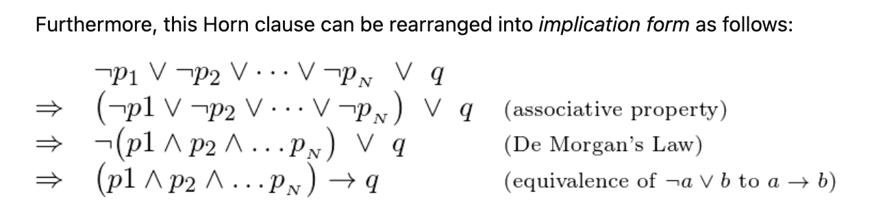

# Helpful Notes

**From https://stackoverflow.com/questions/45123756/why-do-we-call-a-disjunction-of-literals-of-which-none-is-positive-a-goal-clause**

## Horn Clause

## Horn Clause Implication Form

## Literals

A literal is a variable/propositional symbol, or the negation of that symbol.